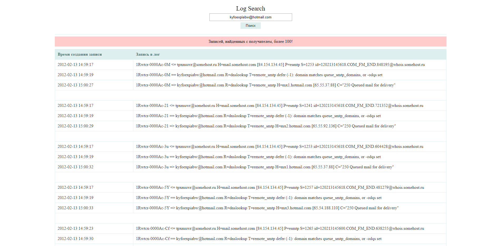

### GPB TEST (Log Search)

#### Install and run

```shell
# Установка зависимостей
carton install

# Парсинг лог-файла
./log_parser.pl [путь к лог-файлу]

# Запуск веб-интерфейса для поиска
hypnotoad log_page.pl
```

Benchmark (VPS: Intel® Xeon® 2 vCPU core / 8 Гб ECC):
- Обработка 10к записей из лога ~ 0 wallclock secs ( 0.07 usr +  0.02 sys =  0.09 CPU)
- Обработка 1млн. записей из лога ~ 17 wallclock secs ( 6.54 usr +  1.60 sys =  8.14 CPU)

Пример интерфейса: [http://46.36.223.44:8080/](http://46.36.223.44:8080/ "Пример: Log Search")

Пример адреса: kyfoexpiabw@hotmail.com


